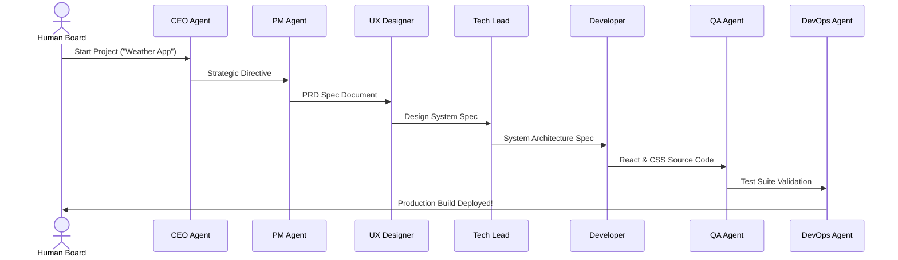
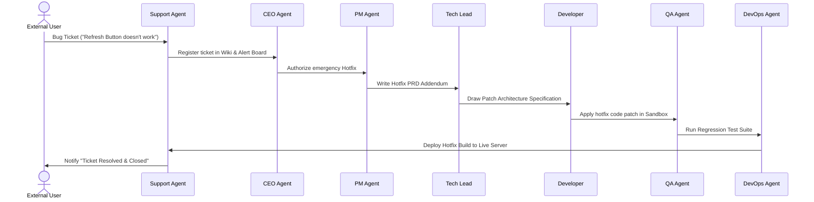

# Xsoft 🌌
### The Autonomous AI Agent Software House

> *"In the future, we will see the first billion-dollar one-person company. It will be run entirely by autonomous AI agents coordinated by a single strategic human."*

`Xsoft` is a proof-of-concept, full-stack simulation of a fully autonomous software enterprise. It operates a coordinated team of **8 specialized AI agents** that manage everything from business analysis to product design, coding, testing, deployment, and customer support, all synced in real-time.

Designed with a premium glassmorphic dashboard, `Xsoft` illustrates a new paradigm in software engineering: **The complete fusion of Technical Support and Research & Development (R&D)**.

---

## 🌟 The Vision & Strategy

### 1. The 1-Person Hyperscale Enterprise
In `Xsoft`, the human is not a manager of people, but the **strategic investor and visual board director**. The human provides high-level directives or reports bugs. The autonomous agent grid translates these into specifications, drafts designs, writes functional code, performs testing, and deploys builds in minutes.

### 2. The Tesla/SpaceX Synergy (xAI, Grok, & Colossus)
Our long-term architectural goal is to make software creation "infrastructure-agnostic" yet heavily optimized for hyper-scale models. By designing this workflow, we prepare an agency framework that can run entirely on frontier models like **Grok** and compute clusters like **Colossus**, reducing the marginal cost of software development to zero.

### 3. Support & R&D Fusion
Traditional software companies isolate customer support behind layers of bureaucracy. In `Xsoft`, **Support and Engineering are the same department**. 
* Simple issues are resolved instantly by a 1st-level Support Agent.
* Complex bug reports bypass traditional filters, going directly to the CEO, PM, Tech Lead, and Developer. 
* A self-healing loop is triggered: a patch is coded, validated by QA, and deployed to production automatically.

---

## ⚙️ Multi-Agent Org Chart

Xsoft coordinates eight distinct AI agents, each with dedicated system prompts and responsibilities:

*   **CEO Agent**: Outlines company vision, aligns product goals, and authorizes emergency hotfixes.
*   **PM Agent**: Translates business goals into Product Requirement Documents (PRDs) with tracked requirement IDs.
*   **UX Designer**: Builds the design system rules (neon colors, glassmorphic themes) and conducts visual QA.
*   **Tech Lead**: Drafts the System Architecture Specifications (SAD) and splits work into developer-ready tasks.
*   **Developer Agent**: Writes clean React & CSS code, outputting it directly to the active sandbox folder.
*   **QA Agent**: Validates code correctness, runs automated test suites, and compiles test reports.
*   **DevOps Agent**: Automates integration (CI/CD) and deploys verified builds to production.
*   **Support Agent**: Monitors incoming tickets, creates issue pages, and reports resolution back to users.

---

## 🚀 Unified Agent Workflows

`Xsoft` supports two automated reactive loops handled by the backend orchestrator:

### A. The Greenfield Product Loop


### B. The Self-Healing R&D Support Loop


---

## 💻 The Dashboard Interface

The workspace includes a high-fidelity web interface built with a deep-indigo space aesthetic and glassmorphic layouts:

1.  **Sede Centrale (HQ)**: An interactive org-chart displaying agent roles, statuses, and live execution animations. Clicking on a node exposes the agent's core system prompt.
2.  **Canali Chat**: A Slack-style message hub. Watch the agents communicate, exchange data, and report progress across `#boardroom`, `#product-ux`, `#engineering`, `#support-tickets`, and `#ops`.
3.  **Workspace Browser**: A tree file explorer synchronized with the workspace. Select and view generated documents or source files dynamically using a built-in markdown rendering engine.
4.  **App Sandbox Preview**: An embedded browser frame mounting the developer-compiled sandbox component. Vite Hot Module Replacement (HMR) allows you to see the generated app reload instantly without losing the dashboard's chat history.
5.  **Support Hub**: A terminal where users submit tickets to launch the self-healing cycle.

---

## 🛠️ Getting Started

### 📋 Prerequisites
*   **Python 3.10+**
*   **Node.js v18+** & **npm**

### 1. Clone & Setup Workspace
Ensure your project directories are set:
```bash
git clone <your-repository-url>
cd Xsoft
```

### 2. Launch Backend Server
The backend requires a `GEMINI_API_KEY` environment variable to run the agent inference engine.
```bash
# Navigate to backend
cd backend

# Create and activate python virtual environment
python -m venv venv
source venv/bin/activate

# Install dependencies
pip install -r requirements.txt

# Run server from workspace root to resolve imports
cd ..
PYTHONPATH=. python backend/main.py
```
The server will start on `http://127.0.0.1:8000` with WebSocket support at `ws://127.0.0.1:8000/ws`.

### 3. Launch Frontend Development Server
```bash
# Navigate to frontend
cd frontend

# Install Node dependencies
npm install

# Run Vite dev server
npm run dev
```
Open your browser and navigate to `http://localhost:5173/` to interact with the dashboard.

---

## 📄 License
This project is open-source and licensed under the MIT License.

*Disclaimer: This is an experimental simulation to test multi-agent workflows and should be used as a concept playground.*
