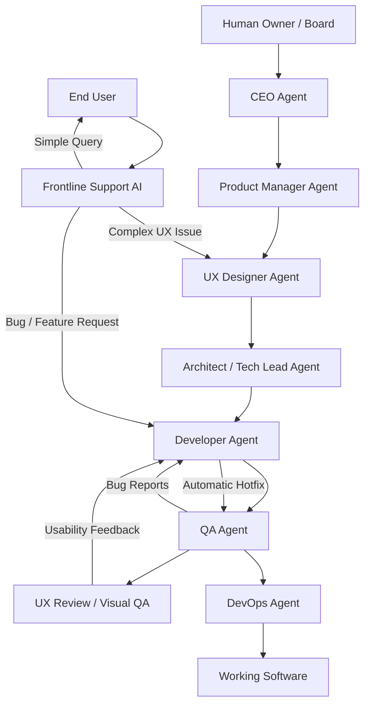

# Xsoft: L'Azienda Software Autonoma di Agenti (Brainstorming)

Questo documento raccoglie le idee, l'architettura e la struttura organizzativa per il nostro esperimento: creare una software house composta interamente da agenti AI autonomi, guidati o supervisionati da un singolo essere umano (l'Owner/Board).

---

## 1. La Visione (The Goal)
L'obiettivo è creare un framework o una piattaforma in cui più agenti AI con ruoli specializzati (CEO, Product Manager, Tech Lead, Developer, QA, DevOps) collaborano per prendere una richiesta di alto livello dell'utente, progettarla, scriverla, testarla e metterla in produzione in modo autonomo.

### Il Target: "1-Person Million-Dollar Company"
*   **Ruolo Umano**: L'investitore, il decisore strategico finale, e il validatore dell'esperienza utente (Human-in-the-Loop).
*   **Ruolo degli Agenti**: Esecuzione completa del ciclo di vita del software (SDLC - Software Development Life Cycle).

---

## 2. L'Organigramma degli Agenti & Il Ciclo di Supporto

Per eliminare le inefficienze tipiche delle software house tradizionali, proponiamo un modello in cui **Supporto Tecnico e R&D sono fusi nello stesso reparto**. Non c'è un filtro di supporto che risponde con messaggi preconfezionati: le segnalazioni tecniche e i bug reali arrivano direttamente a chi progetta e scrive il codice.

### I Ruoli Dettagliati:
1.  **CEO Agent (Chief Executive Officer)**
    *   *Input*: Visione strategica dell'utente umano, budget, priorità aziendali.
    *   *Output*: Decisioni strategiche, priorità dei progetti, allocazione risorse per gli agenti, feedback finale all'utente.
2.  **Product Manager Agent (PM)**
    *   *Input*: Direttive dal CEO.
    *   *Output*: Requisiti di prodotto (PRD - Product Requirement Document), User Stories, criteri di accettazione.
3.  **UX Designer Agent (L'Esperto di Ricerca ed Esperienza Utente)**
    *   *Input*: PRD e requisiti dal PM, segnalazioni di problemi di usabilità dagli utenti.
    *   *Output*: 
        *   **User Persona & Research Report**: Profilo degli utenti target, competitor analysis, flussi d'uso principali.
        *   **Design System & Style Guide**: Palette di colori premium, tipografia, spacing, regole di micro-animazione.
        *   **Wireframes / UI Mockups**: Layout delle pagine descritti in Markdown (struttura logica) o template HTML/CSS di base.
4.  **Architect / Tech Lead Agent**
    *   *Input*: PRD dal PM, Report UX e Wireframes dal UX Designer.
    *   *Output*: System Design Document (SDD), scelta del tech stack, scomposizione in task tecnici (Task List per il Developer).
5.  **Developer Agent (Sviluppatore & Supporto di 2° Livello)**
    *   *Input*: Task tecnici, specifiche dal Tech Lead, Style Guide e Wireframes dal UX Designer, ticket tecnici complessi inviati dal filtro di supporto.
    *   *Output*: Codice sorgente (HTML/CSS/JS, componenti React, logica backend), risoluzione di bug a caldo (hotfix).
6.  **QA Agent (Quality Assurance)**
    *   *Input*: Requisiti dal PM, Codice sorgente dal Developer.
    *   *Output*: Test suite automatici, report di bug tecnici. Se i test falliscono, rimanda i bug al Developer.
7.  **UX Review / Visual QA (Fase gestita dal UX Agent)**
    *   *Input*: Codice frontend pronto, Style Guide originale.
    *   *Output*: Valutazione della fedeltà visiva, controlli di accessibilità, fluidità delle animazioni e feedback di usabilità per il Developer.
8.  **Frontline Support AI (Filtro di 1° Livello)**
    *   *Input*: Email, ticket o messaggi in chat degli utenti finali.
    *   *Output*: Risposte istantanee per problemi semplici (es. reset password, FAQ). Se l'anomalia riguarda un bug o una richiesta complessa, inoltra direttamente al Developer o al UX Designer senza passaggi intermedi.
9.  **DevOps Agent**
    *   *Input*: Codice approvato sia dal QA che dal UX Agent.
    *   *Output*: Deployment automatico, configurazione CI/CD, monitoraggio log.

---

## 3. Il Ciclo Unificato Supporto & R&D (Engineering Support Loop)

Questa unione strategica porta tre vantaggi fondamentali:
*   **Feedback d'oro istantaneo**: Qualsiasi bug riscontrato sul campo diventa immediatamente un test fallito per il QA e un task di massima priorità per il Developer.
*   **Supporto competente**: Chi risponde al ticket ha la visibilità dell'intera base di codice e dell'architettura (o è l'agente Developer stesso). Può spiegare *perché* si è verificato l'errore o fornire una patch temporanea sul momento.
*   **Self-healing (Auto-correzione)**: L'utente segnala un problema -> Il Supporto AI lo inoltra al Developer -> Il Developer corregge il file -> Il QA valida il fix -> DevOps fa il deploy automatico -> Il Supporto AI notifica l'utente che il problema è risolto, il tutto in pochi minuti e in autonomia.

---

## 4. L'Infrastruttura di Comunicazione e Memoria (The Shared Brain)

Per permettere agli agenti di collaborare, non usiamo solo una chat temporanea, ma implementiamo il pattern **LLM Wiki** proposto da Andrej Karpathy. La wiki rappresenta la memoria a lungo termine, persistente e cumulativa dell'azienda.

### Struttura della Wiki aziendale (EKB - Enterprise Knowledge Base):
Gli agenti lavorano all'interno di una cartella condivisa `/wiki/` strutturata così:
*   `wiki/index.md`: Il catalogo dei contenuti, delle entità e dei moduli software. Sostituisce i complessi sistemi RAG per la ricerca di contesti a piccole/medie dimensioni.
*   `wiki/log.md`: Un registro cronologico delle attività (es. `## [2026-05-20] Ingest | Requisiti Todo App`).
*   `wiki/schema/AGENTS.md`: Il documento di governance che spiega agli agenti come devono aggiornare la wiki, le convenzioni da seguire e le regole per risolvere le contraddizioni.
*   `wiki/products/`: Contiene i PRD scritti dal PM e le guide di stile del UX Designer.
*   `wiki/architecture/`: Contiene i System Design Document (SDD) del Tech Lead.
*   `wiki/operations/`: Storico dei ticket risolti, report del QA e log di deployment di DevOps.

### Come funziona il flusso con la Wiki:
1.  **Ingest & Update**: Quando viene introdotta una nuova feature o segnalato un bug, l'agente competente non si limita a discuterne in chat, ma aggiorna la wiki (es. modifica `wiki/products/features.md` o crea una pagina in `wiki/operations/bug_reports.md`). Una singola modifica può toccare 2-3 pagine diverse della wiki per mantenere i collegamenti aggiornati.
2.  **Query**: Prima di scrivere codice o fare modifiche, il Developer e il Tech Lead leggono `wiki/index.md` e le pagine correlate per capire l'intento del design precedente. La conoscenza non viene ricreata da zero ad ogni domanda, ma è già sintetizzata.
3.  **Dream Cycle / Linting**: Un processo in background (es. avviato periodicamente) in cui un agente analizza la wiki per trovare contraddizioni, collegamenti interrotti o concetti duplicati, consolidando la memoria aziendale.

---

## 5. Specifiche della GUI (Ispirata a Paperclip)

Per gestire questa agenzia di agenti in modo chiaro ed esteticamente premium (sulla scia di Paperclip.ing), progetteremo una **Dashboard Web ad alto impatto visivo** (Vite + React + Vanilla CSS con Glassmorphism, animazioni fluide e dark mode).

### I Componenti della GUI:
1.  **Dashboard / Overview (La Sede Centrale)**:
    *   **Organigramma Interattivo**: Mostra i nodi dei vari agenti (CEO, PM, UX, Tech Lead, Dev, QA, DevOps) con indicatori di stato dinamici (es. `Stato: Inattivo` (grigio), `Ricerca UX` (pulsante viola), `Scrittura Codice` (pulsante verde), `Testing` (giallo pulsante)).
    *   **Monitor delle Risorse (Token & Budget)**: Un widget che traccia in tempo reale la spesa accumulata per ogni agente (in dollari fittizi o token reali consumati).

2.  **Il Canale di Comunicazione (The Feed / Virtual Office)**:
    *   Una chat multi-canale simile a Slack o Discord:
        *   `#boardroom`: Dove il CEO aggiorna l'Owner umano e chiede feedback/approvazioni.
        *   `#product-ux`: Discussione tra PM e UX Designer sulle specifiche, user personas e design system.
        *   `#engineering`: Scambio di compiti tra Tech Lead, Developer e QA.
        *   `#ops`: Log di DevOps e deploy.
    *   I messaggi avranno un design specifico per ogni ruolo (avatar dedicati, blocchi di codice evidenziati per il Dev, report tabellari per il QA e moodboard visive per il UX Designer).

3.  **Workspace & File Explorer (Il Repository)**:
    *   Un visualizzatore di file interattivo (File Tree a sinistra, Code Editor/Viewer a destra) per vedere il codice sorgente reale, la Style Guide UX, o il PRD scritti dagli agenti man mano che lavorano sul progetto.

4.  **Pannello "Human-in-the-Loop" (Governance)**:
    *   La nostra console di comando. Quando un agente richiede la validazione umana (es. il PM ha finito il PRD, o il UX Designer ha finito il Design System), la dashboard mostra una notifica bloccante che permette al Board (l'utente umano) di:
        *   **Approvare** per passare alla fase successiva.
        *   **Rifiutare con feedback** per far fare un'ulteriore iterazione all'agente.

---

## 6. Architettura Tecnica Proposta

Per rendere il sistema modulare ed efficiente, utilizzeremo:
*   **Backend (Python)**:
    *   Gestione degli agenti con un framework asincrono (es. FastAPI + asyncio).
    *   LLM Connector: Adapter per API commerciali (Gemini, OpenAI) e LLM locali (Ollama).
    *   WebSocket Server per inviare in tempo reale gli aggiornamenti di stato e i log degli agenti al frontend.
*   **Frontend (Vite + React + Vanilla CSS)**:
    *   UI moderna con effetto vetro (Glassmorphism), sfondi sfumati dinamici, transizioni fluide per simulare l'attività degli agenti.
    *   WebSocket Client per ricevere istantaneamente le chat e gli aggiornamenti sul codice.

---

## 7. Primi Passi per lo Sviluppo del Codice

1.  **Fase 1: Creazione della Struttura di Base** (Repository e configurazione).
2.  **Fase 2: Backend & Simulator degli Agenti** (Implementazione delle classi `Agent` e del loop di orchestrazione con messaggi simulati/LLM).
3.  **Fase 3: Sviluppo della Dashboard Premium** (Frontend React con mock data in tempo reale).
4.  **Fase 4: Integrazione Completa** (Connessione via WebSocket per far cooperare backend e frontend in tempo reale).

---

## 8. Ripensare i Flussi: Agent AI vs Lavoratore Umano (L'Agentic Advantage)

Progettare una software house di agenti non significa copiare ciecamente i flussi di lavoro umani. Dobbiamo ripensare i processi basandoci sulle caratteristiche uniche delle AI:

### A. Memoria Condivisa Istantanea vs Meeting
*   *Umano*: I team umani perdono ore in allineamenti, stand-up meeting e mail per sincronizzarsi. Le informazioni si frammentano o si perdono nel passaggio di consegne (context switching).
*   *Agente*: Gli agenti condividono uno stato globale istantaneo (es. un database vettoriale, una memoria a lungo termine condivisa o un repository Git centrale). Quando il CEO cambia una priorità, *tutti* gli agenti ne sono a conoscenza all'istante (latenza zero).
*   *Flusso ottimizzato*: Nessun meeting o report di stato. Gli allineamenti avvengono tramite letture atomiche della memoria globale.

### B. Parallelizzazione Massiva vs Linearità Temporale
*   *Umano*: Uno sviluppatore umano lavora su un compito alla volta. Se ci sono più strade per risolvere un bug, ne prova una alla volta.
*   *Agente*: L'agente Developer può sdoppiarsi in 5 sotto-agenti (branch paralleli), ciascuno dei quali prova a scrivere il codice in modo diverso. Il QA Agent testa contemporaneamente tutte e 5 le versioni in sandbox isolate e sceglie la migliore.
*   *Flusso ottimizzato*: Generazione di varianti parallele di codice e auto-selezione basata su metriche di performance e superamento dei test.

### C. Scalabilità Dinamica On-Demand vs Assunzioni
*   *Umano*: Per gestire un picco di bug, servono settimane per reclutare, fare onboarding e allocare budget.
*   *Agente*: Se il Frontline Support AI rileva un afflusso improvviso di ticket di bug, l'orchestratore può scalare istantaneamente il numero di agenti Developer (es. da 1 a 10) per risolvere i problemi in parallelo, per poi spegnerli non appena i ticket scendono a zero.
*   *Flusso ottimizzato*: Dimensionamento elastico del team di sviluppo basato sul carico di lavoro reale (es. ticket aperti o milestone del progetto).

### D. Rigore di Validazione e Compilazione vs Creatività
*   *Umano*: Gli umani fanno errori di battitura o sviste, ma hanno intuito.
*   *Agente*: Gli agenti AI scrivono codice molto velocemente ma possono allucinare. Hanno bisogno di guardrail severi.
*   *Flusso ottimizzato*: Il codice scritto dall'agente Developer **non è mai considerato valido** finché non supera una pipeline automatica di compilazione e testing gestita dal QA Agent. Se fallisce, il feedback è immediato e la correzione avviene in un loop chiuso che non richiede l'intervento umano.

